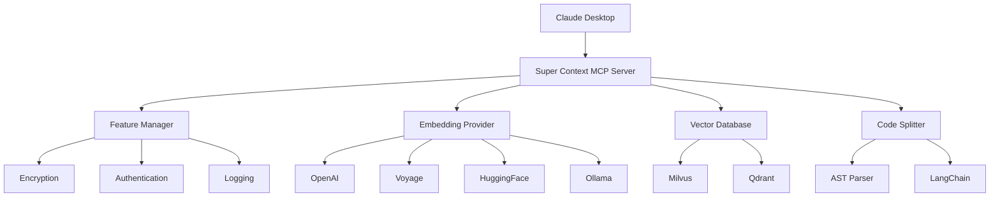

# Super Context MCP Server

> **🔍 AI-Powered Semantic Code Search for Claude Desktop**

Transform how you search and understand code. Index any codebase using AI embeddings, then search with natural language queries. Perfect for Claude Desktop integration.


[](https://www.npmjs.com/package/@hongkongkiwi/super-context-mcp)
[](https://www.npmjs.com/package/@hongkongkiwi/super-context-mcp)
[](https://opensource.org/licenses/MIT)

## ⚡ Quick Start

### 1. Install
```bash
npm install -g @hongkongkiwi/super-context-mcp
```

### 2. Configure Claude Desktop

**Location**: `~/Library/Application Support/Claude/claude_desktop_config.json` (macOS)

**Basic Setup** (just add your API key):
```json
{
  "mcpServers": {
    "super-context": {
      "command": "npx",
      "args": ["@hongkongkiwi/super-context-mcp"],
      "env": {
        "OPENAI_API_KEY": "sk-your-api-key-here"
      }
    }
  }
}
```

### 3. Restart Claude Desktop → Start Searching! 🎉

## 🚀 What It Does

| Feature | Description | Example |
|---------|-------------|---------|
| **🔍 Semantic Search** | Find code by intent, not just keywords | *"Find authentication functions"* |
| **📂 Smart Indexing** | Understands code structure across languages | TypeScript, Python, Java, Go, Rust... |
| **🧠 AI-Powered** | Uses embeddings for intelligent matching | Finds related concepts, not just text |
| **⚡ Vector Search** | Instant results from large codebases | Search 10,000+ files in milliseconds |

## 💬 Usage Examples

### Example 1: Index & Search a Project
```
👤 You: "Index my React project at /Users/me/projects/ecommerce"
🤖 Claude: "✅ Indexed 247 files from your React project"

👤 You: "Find components that handle user authentication"
🤖 Claude: "Found 3 authentication components:
    1. LoginForm.tsx - Main login component with validation
    2. AuthProvider.tsx - Context provider for auth state
    3. ProtectedRoute.tsx - Route wrapper for authenticated pages"
```

### Example 2: Security Analysis
```
👤 You: "Search for potential security vulnerabilities" 
🤖 Claude: "Found 2 potential security issues:
    1. SQL injection risk in database.js:45 - unsanitized input
    2. XSS vulnerability in UserProfile.tsx:67 - unescaped output"
```

### Example 3: Code Architecture Understanding
```
👤 You: "How is state management implemented in this codebase?"
🤖 Claude: "Found 4 state management patterns:
    1. Redux store in store/ directory - global app state
    2. React Context in contexts/ - user authentication state  
    3. useState hooks - local component state
    4. React Query - server state management"
```

## 🛠️ Core Features

### ✅ Always Available
- **Multi-Language Support**: TypeScript, JavaScript, Python, Java, Go, Rust, C/C++, C#, PHP, Ruby, Swift, Kotlin, Scala
- **Smart Code Splitting**: AST-aware parsing for accurate code understanding
- **Vector Search**: Lightning-fast similarity search using Milvus or Qdrant
- **Two Operation Modes**: Filesystem (direct folder access) or Stateless (content-only)

### 🔧 Configurable Options
- **Multiple Embedding Providers**: OpenAI, Voyage, HuggingFace, Gemini, Ollama, OpenRouter, Vertex AI, Bedrock
- **Vector Database Choice**: Milvus (default) or Qdrant
- **Content Encryption**: Protect sensitive code with AES-256 encryption
- **Authentication**: Token-based access control
- **Flexible Transports**: STDIO (default), HTTP, HTTPS

## 📋 Environment Variables Reference

### Required
| Variable | Description | Example |
|----------|-------------|---------|
| `OPENAI_API_KEY` | OpenAI API key (or another provider) | `sk-proj-abc123...` |

### Embedding Providers
| Provider | API Key Variable | Model Variable | Default Model |
|----------|------------------|----------------|---------------|
| **OpenAI** | `OPENAI_API_KEY` | `EMBEDDING_MODEL` | `text-embedding-3-small` |
| **Voyage** | `VOYAGE_API_KEY` | `EMBEDDING_MODEL` | `voyage-code-3` |
| **HuggingFace** | `HUGGINGFACE_API_KEY` | `EMBEDDING_MODEL` | `BAAI/bge-small-en-v1.5` |
| **Gemini** | `GEMINI_API_KEY` | `EMBEDDING_MODEL` | `text-embedding-004` |
| **Ollama** | *(local)* | `OLLAMA_MODEL` | `nomic-embed-text` |
| **OpenRouter** | `OPENROUTER_API_KEY` | `EMBEDDING_MODEL` | `text-embedding-3-small` |

### Vector Databases
| Database | Configuration | Default |
|----------|---------------|---------|
| **Milvus** | `MILVUS_ADDRESS=localhost:19530`<br>`MILVUS_TOKEN=token` | ✅ Default |
| **Qdrant** | `VECTOR_DATABASE=qdrant`<br>`QDRANT_URL=http://localhost:6333`<br>`QDRANT_API_KEY=key` | Alternative |

### Optional Security Features
| Feature | Environment Variable | Description |
|---------|---------------------|-------------|
| **Content Encryption** | `ENCRYPTION_KEY=your-32-char-key` | Encrypt sensitive code with AES-256 |
| **Authentication** | `ACCESS_TOKEN=your-16-char-token` | Require token for access |
| **Stateless Mode** | `MCP_STATELESS_MODE=true` | No filesystem access (content-only) |

### Optional Transport Features
| Feature | Environment Variable | Description |
|---------|---------------------|-------------|
| **HTTP Server** | `MCP_TRANSPORT=http`<br>`MCP_PORT=3000` | REST API transport |
| **HTTPS Server** | `MCP_TRANSPORT=https`<br>`MCP_SSL_KEY_PATH=key.pem`<br>`MCP_SSL_CERT_PATH=cert.pem` | Secure REST API |
| **CORS** | `MCP_CORS=true`<br>`MCP_CORS_ORIGINS=https://app.com` | Web client access |
| **Rate Limiting** | `MCP_RATE_LIMIT=100` | Requests per minute limit |

### Logging & Debugging
| Variable | Values | Default | Description |
|----------|--------|---------|-------------|
| `LOG_LEVEL` | `silent`, `error`, `warn`, `info`, `debug` | `warn` | Logging verbosity |
| `LOG_SECURITY` | `true`, `false` | `false` | Log security events |
| `LOG_PERFORMANCE` | `true`, `false` | `false` | Log performance metrics |

## 📖 Configuration Examples

### Basic (Most Users)
```json
{
  "mcpServers": {
    "super-context": {
      "command": "npx",
      "args": ["@hongkongkiwi/super-context-mcp"],
      "env": {
        "OPENAI_API_KEY": "sk-your-key"
      }
    }
  }
}
```

### Secure (Private Projects)
```json
{
  "mcpServers": {
    "super-context-secure": {
      "command": "npx",
      "args": ["@hongkongkiwi/super-context-mcp"],
      "env": {
        "OPENAI_API_KEY": "sk-your-key",
        "ENCRYPTION_KEY": "your-32-character-encryption-key-here"
      }
    }
  }
}
```

### Alternative Providers
```json
{
  "mcpServers": {
    "super-context-voyage": {
      "command": "npx",
      "args": ["@hongkongkiwi/super-context-mcp"],
      "env": {
        "VOYAGE_API_KEY": "pa-your-voyage-key",
        "EMBEDDING_MODEL": "voyage-code-3",
        "VECTOR_DATABASE": "qdrant",
        "QDRANT_URL": "http://localhost:6333"
      }
    }
  }
}
```

### Stateless Mode (No File Access)
```json
{
  "mcpServers": {
    "super-context-stateless": {
      "command": "npx",
      "args": ["@hongkongkiwi/super-context-mcp"],
      "env": {
        "OPENAI_API_KEY": "sk-your-key",
        "MCP_STATELESS_MODE": "true",
        "ENCRYPTION_KEY": "your-encryption-key-for-uploads"
      }
    }
  }
}
```

### Multiple Configurations
```json
{
  "mcpServers": {
    "super-context-basic": {
      "command": "npx",
      "args": ["@hongkongkiwi/super-context-mcp"],
      "env": {
        "OPENAI_API_KEY": "sk-your-key"
      }
    },
    "super-context-secure": {
      "command": "npx", 
      "args": ["@hongkongkiwi/super-context-mcp"],
      "env": {
        "VOYAGE_API_KEY": "pa-your-key",
        "ENCRYPTION_KEY": "secure-key-32-characters-long",
        "MCP_STATELESS_MODE": "true",
        "LOG_LEVEL": "info"
      }
    }
  }
}
```

## 🔧 Available Tools

### Filesystem Mode (Default)
| Tool | Purpose | Usage |
|------|---------|-------|
| `index_codebase` | Index a directory | *"Index /Users/me/projects/my-app"* |
| `search_code` | Search indexed code | *"Find authentication functions"* |
| `get_status` | Check server status | *"What's the server status?"* |
| `clear_index` | Clear search index | *"Clear the index for this project"* |

### Stateless Mode
| Tool | Purpose | Usage |
|------|---------|-------|
| `index_files` | Index uploaded content | Upload files → *"Index these as project 'analysis'"* |
| `search_code` | Search indexed projects | *"Search project 'analysis' for security issues"* |
| `get_status` | Check server status | *"What projects are indexed?"* |
| `clear_index` | Clear project data | *"Clear project 'analysis'"* |

## 🏗️ Architecture



## 🔒 Security & Privacy

### Data Privacy
- **🏠 Local First**: Runs on your machine, data stays local
- **🔐 Optional Encryption**: AES-256 encryption for sensitive code
- **🚫 No Telemetry**: No usage data sent anywhere
- **🔑 API Key Security**: Keys stored in secure Claude Desktop config

### Security Features
- **🛡️ Content Encryption**: Automatic sensitive file detection and encryption
- **🔐 Authentication**: Token-based access control for HTTP transports
- **⚡ Rate Limiting**: Prevent abuse with configurable limits
- **🔒 HTTPS Support**: TLS encryption for network transports
- **📝 Audit Logging**: Security event logging for monitoring

### Sensitive Content Detection
Automatically encrypts files containing:
- API keys, secrets, passwords, tokens
- `.env`, `.secret`, `.key` files
- Database connection strings
- Private/confidential code markers

## 🐛 Troubleshooting

### Common Issues

**❌ "No embedding provider API key found"**
```bash
# Solution: Add API key to config
"env": { "OPENAI_API_KEY": "sk-your-key" }
```

**❌ "Connection closed" (Windows)**
```json
// Solution: Add cmd wrapper
{
  "command": "cmd",
  "args": ["/c", "npx", "@hongkongkiwi/super-context-mcp"]
}
```

**❌ "Module not found"**
```bash
# Solution: Install globally
npm install -g @hongkongkiwi/super-context-mcp
```

**❌ JSON syntax errors**
```bash
# Solution: Validate JSON online
# Common issues: trailing commas, missing quotes
```

### Debug Mode
```json
"env": {
  "LOG_LEVEL": "debug",
  "LOG_SECURITY": "true"
}
```

### Check Logs (macOS)
```bash
tail -f ~/Library/Logs/Claude/mcp*.log
```

### Test Connection
Ask Claude: *"What's the Super Context server status?"*

## 📚 Advanced Configuration

### Performance Tuning
```json
"env": {
  "EMBEDDING_MODEL": "text-embedding-3-small",  // Faster
  "MILVUS_ADDRESS": "localhost:19530",          // Local DB
  "LOG_LEVEL": "error"                          // Less logging
}
```

### High Security Setup
```json
"env": {
  "ENCRYPTION_KEY": "your-32-character-key",
  "ACCESS_TOKEN": "your-16-character-token",
  "MCP_STATELESS_MODE": "true",
  "LOG_SECURITY": "true"
}
```

### Multi-Project Setup
```json
{
  "mcpServers": {
    "work-projects": {
      "command": "npx",
      "args": ["@hongkongkiwi/super-context-mcp"],
      "env": {
        "OPENAI_API_KEY": "work-key",
        "ENCRYPTION_KEY": "work-encryption-key"
      }
    },
    "personal-projects": {
      "command": "npx",
      "args": ["@hongkongkiwi/super-context-mcp"],
      "env": {
        "VOYAGE_API_KEY": "personal-key",
        "VECTOR_DATABASE": "qdrant"
      }
    }
  }
}
```

## 🤝 Contributing

This project is a fork of [claude-context](https://github.com/zilliztech/claude-context) with enhanced MCP integration and security features.

### Key Enhancements
- ✨ Standard MCP configuration patterns
- 🔐 Optional security features (encryption, auth)
- 🔄 Multiple transport protocols
- 📊 Comprehensive logging and monitoring
- 🛠️ Flexible embedding provider support

## 📄 License

MIT License - see [LICENSE](LICENSE) for details.

## 🙏 Acknowledgments

- **[Zilliz Team](https://github.com/zilliztech/claude-context)** - Original claude-context project
- **[Anthropic](https://modelcontextprotocol.io/)** - Model Context Protocol specification
- **[Milvus](https://milvus.io/)** & **[Qdrant](https://qdrant.tech/)** - Vector database engines

---

## 🆘 Need Help?

1. **📖 Documentation**: [MCP Setup Guide](./MCP_SETUP_GUIDE.md) | [Optional Features](./OPTIONAL_FEATURES.md)
2. **🐛 Issues**: [GitHub Issues](../../issues)
3. **💬 Discussions**: [GitHub Discussions](../../discussions)
4. **📧 Support**: Check the documentation first, then open an issue

**Quick Links**: [Setup](./MCP_SETUP_GUIDE.md) | [Features](./OPTIONAL_FEATURES.md) | [Examples](./claude-desktop-configs/) | [Troubleshooting](#-troubleshooting)